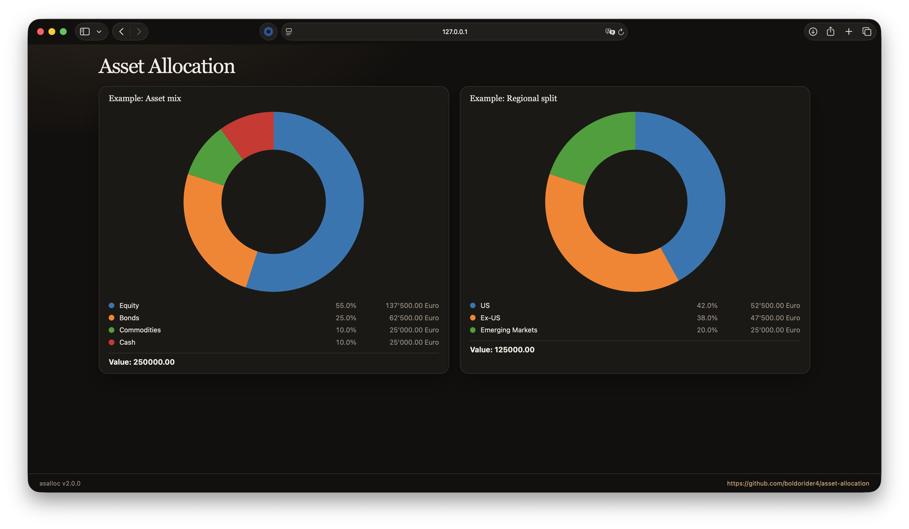

# asset-allocation

Personal portfolio reporter: load holdings from JSON, optionally fetch prices and broker positions, then chart allocation (regional split, growth sleeve, total net worth).



## Setup

```bash
make install
```

Requires Python 3.10+. Dependencies include `numpy`, `matplotlib`, `yfinance`, `playwright`, and `pytr`.

## Holdings file

Copy or create `assets.json` in the project root. It must be a JSON object whose keys are portfolio buckets used by `allocation.py`:

| Key | Purpose |
| --- | --- |
| `equity_portfolio` | Equity positions (used for DM/EM and US splits) |
| `fixed_maturity_bond_portfolio` | Fixed-maturity bonds |
| `cash_portfolio` | Cash / emergency fund |
| `bond_portfolio` | Other bonds |
| `commodity_portfolio` | Commodities |
| `pension_portfolio` | Pension |

Each bucket is an array of position objects. Typical fields:

| Field | Meaning |
| --- | --- |
| `ISIN` | Identifier for price lookup (may be `null` if you only use `value`) |
| `shares` | Units held (optional if `value` is set) |
| `value` | Fixed position value in account currency (optional if priced from ISIN) |
| `broker` | Broker label (used by implementations where relevant) |
| `dmem` | Share of position treated as **developed** markets (0–1) |
| `dmem_other` | When a country is “other”, fraction treated as developed (0–1) |
| `usavn` | Within developed markets, fraction attributed to the **US** (0–1) |

`assets.json` is listed in `.gitignore` so you can keep real balances private; `assets.sample.json` is a redacted starting point.

## Price source

Positions are built through `position/factory.py` (JustETF by default, Yahoo Finance via `yfinance` for some ISINs). With `--fetch-prices`, quotes are written to `cache.json` (also gitignored). `--fetch-geosplit` refreshes country weights in the same cache.

## Run

From the repository root, after `make install`:

```bash
asalloc update
```

Useful `update` flags:

| Flag | Purpose |
| --- | --- |
| `--fetch-prices` | Scrape live quotes into `cache.json` |
| `--fetch-geosplit` | Scrape country allocations into `cache.json` |
| `--fetch-oskar` / `--fetch-scalable` / `--fetch-tr` | Scrape broker holdings |
| `--incognito` | Scale display values |
| `--assets-file PATH` | Use a holdings file other than `assets.json` |
| `--plot {web,pie-chart}` | Chart backend (default `web`) |

## Web visualizer

The default chart backend (`WebChart`) writes one JSON `*.raw` file per pie into `~/.local/asalloc/visualizer/data/`. Scaffold the JS app (without touching existing raw files) with:

```bash
make web
```

Then run `asalloc update` and serve the visualizer over HTTP (browsers cannot list `file://` directories):

```bash
make serve
# or
asalloc serve
```

Stop it with `make stop-serve`.

The bind address, HTTP port, and directory come from `config.ini` (`[server] address`, `port`, and `directory`; defaults `localhost`, `8765`, and `~/.local/asalloc/visualizer`). The server runs in the background.

| Target | What it does |
| --- | --- |
| `make install` | `pip install -e .` so `asalloc` is on your PATH |
| `make web` | Copy `visual/web` into `~/.local/asalloc/visualizer`, stamp version and GitHub URL |
| `make web-example` | Same, plus sample `*.raw` files (no server, no browser) |
| `make serve` | Background HTTP server for the visualizer dir (from `config.ini`); fails if `asalloc` is not callable |
| `make stop-serve` | Stop the background visualizer server |
| `make service` | Linux: install systemd user units, enable serve + 3-hour update timer |
| `make stop-service` | Linux: stop and disable those user units |
| `make web-clean` | Delete `~/.local/asalloc/visualizer` |

On a headless Debian box, after `make install` and `make service`, put holdings at `~/.local/asalloc/assets.json` and enable lingering so the user units run without a login:

```bash
sudo loginctl enable-linger "$USER"
```

Units live in `systemd/` (`*.service` / `*.timer` for systemd) and are copied to `~/.config/systemd/user/`.

To use matplotlib windows instead, pass `--plot pie-chart` (or set `DEFAULT_VISUALIZER` in `visual/__init__.py`).

## Disclaimer

This is a personal tooling repo, not financial advice. Prices and third-party sites can be wrong or unavailable; verify anything material before you act.
